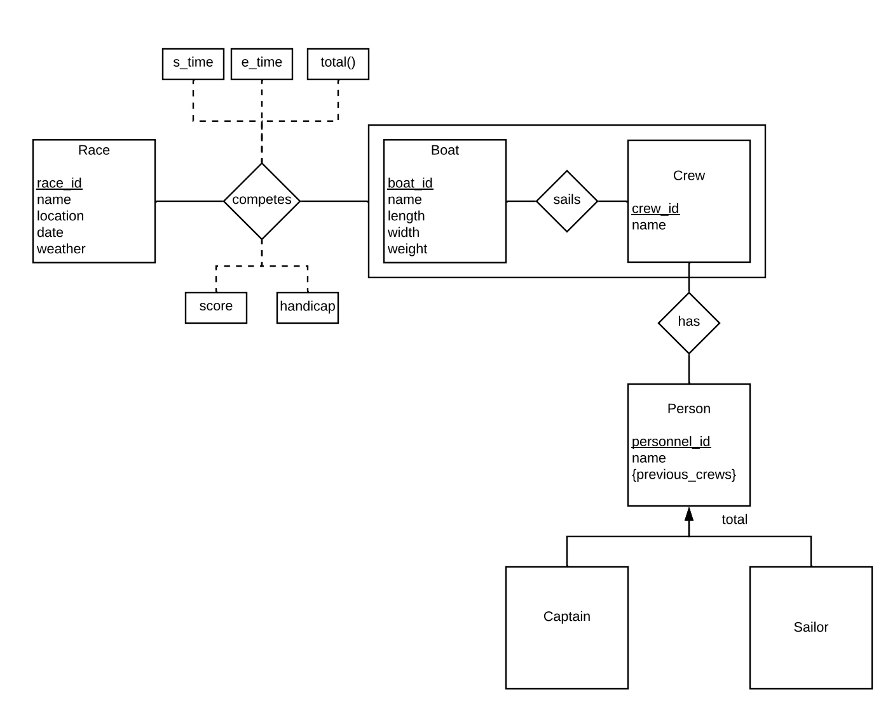

# Implementation

## Heroku Postgres 
For our cloud database, we use Heroku's free tier of their Postgres database. To implement this with our 
Flask application, all that you need to do is make sure that you have installed the python packages SQLAlchemy,
flask-sqlalchemy, and psycopg2. With these technologies, we can access our develop with our cloud 
database.

Here is a quick example of the minimal code needed to set it up: 
```python
from flask import Flask
from flask_sqlalchemy import SQLAlchemy

app = Flask(__name__)
app.config['SQLALCHEMY_DATABASE_URI'] = 'our_connection_string'
db = SQLAlchemy(app)
```

## Database Implemented via Heroku
Our backend database features an array of different relationships between racers, races, boats, and many more. With our backend
database, we are able to maintain different relationships between entities and ensure that functionality remains the same as the UI
shifts. The database and tables are constantly in use by the frontend UI as it fetches, displays, and updates the tables based on user
interaction. Below, you can see the ER diagram implemented in our database. This database is implemented using SQLAlchemy.


## Web Development and User Interface
The Sail with Us frontend is driven by HTML5, CSS, and JavaScript. The backbone of our design
choices is Twitter Bootstrap, a CSS and JavaScript library that is fully reactive. Bootstrap 
allows us to create beautiful web pages that can work with any device. Our design heavily
utilizes tables to display and edit information as well.
